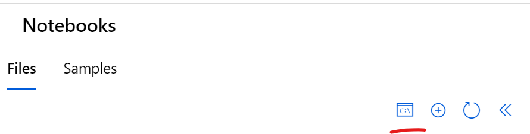
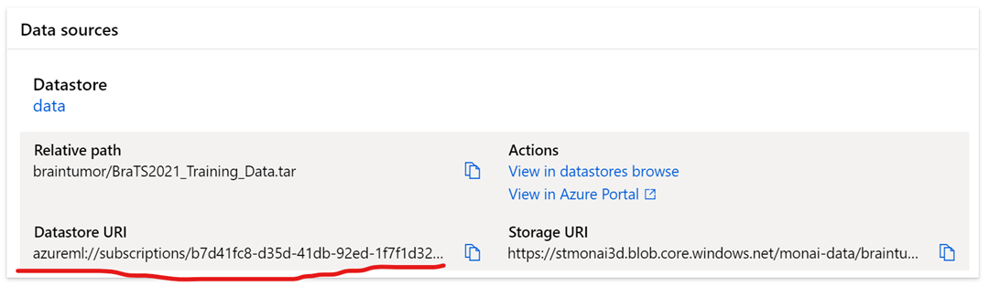

## 						**MONAI installation and running**

#### **Motivation**

#### **Introduction**

#### **Prerequisites**

To run the test, you will need to:

-   have an active [[Azure
    subscription]{.underline}](https://azure.microsoft.com/) that you
    can use for development purposes,

-   have permissions to create resources, set permissions, and create
    identities in this subscription (or at least in one resource group),

    -   Note that to set permissions, you typically need *Owner* role in
        the subscription or resource group - *Contributor* role is not
        enough. This is key for being able to *secure* the setup.

-   [[install the Azure
    CLI]{.underline}](https://learn.microsoft.com/en-us/cli/azure/install-azure-cli).

#### **Installation**

1.  Click on the button below. It will open in Azure Portal a page to
    deploy the resources in your subscription.

---------------------------------------------------------------------------
  **Button**   **Description**
------------ --------------------------------------------------------------
               This setup is intended only for demo purposes. The data is
               still accessible by the users of your subscription when
               opening the storage accounts, and data exfiltration is
               possible.

---------------------------------------------------------------------------

Notes:

-   If someone already provisioned a demo with the same name in your
    subscription, change **Demo Base Name** parameter to a unique value.

-   For provisioning GPU or CPU, you need just use a GPU/CPU SKU value
    for the \"Compute SKU\" parameter, Standard_NC96ads_A100 for
    instance. An overview of the GPU SKU\'s available in Azure can be
    found [[here]{.underline}](https://learn.microsoft.com/en-us/azure/virtual-machines/sizes-gpu).
    Beware though, SKU availability may vary depending on the region you
    choose, so you may have to use different Azure regions instead of
    the default ones.

2.  Once the automatic deployment is finished you can open new workspace
    and after that related Machine Learning Studio

3.  Next you need to create a compute instance to run tutorial
    notebooks. Click Compute icon in the vertical menu on the left. Next
    select Compute instances and [create
    one](https://learn.microsoft.com/en-us/azure/machine-learning/how-to-create-manage-compute-instance?view=azureml-api-2&tabs=azure-studio).

> **NOTES:**
>
> To run the current version of the tutorial (all steps) you need
> Standard_NC96ads_A100. For some notebook steps you can use smaller
> sizes.

4.  Make sure that automatically created **monai-cluster** is based on
    Standard_NC96ads_A100 too.

5.  Once you have your compute instance running. Click Notebooks and
    Terminal icon.

After that you need to clone the repository to have the latest code in
your workspace.

6.  Next you need to get data from
    [Kaggle](https://www.kaggle.com/datasets/dschettler8845/brats-2021-task1).
    In this tutorial we are using only BraTS2021_Training_Data.tar.

7.  You need to put the file in existing or new [Azure Blob
    Storage](https://learn.microsoft.com/en-us/azure/storage/blobs/storage-quickstart-blobs-portal)
    . To do it fast you can use
    [azcopy](https://learn.microsoft.com/en-us/azure/storage/common/storage-use-azcopy-blobs-upload)

8.  After you have data in a blob storage. You need to create [Azure ML
    data
    asset](https://learn.microsoft.com/en-us/azure/machine-learning/how-to-create-data-assets?view=azureml-api-2&tabs=Studio)
    (file type) using "From Azure storage" option.

**Running**

1.  To run the tutorial, you need to go open the first notebook

2.  Make sure your compute instance is still running.

3.  Download config.json file to simplify MLClient creation. After
    downloading you need to upload it to notebooks folder (like on the
    previous image.

> **Loading and training**

1.  In the open 1.load-train-model notebook correct tar_location value
    using your data asset url

2.  Make sure you select Python 3.10 SDK v2 kernel .

>  generated" width="75%" />

3.  Start running the notebook step by step.

4.  The first step (on the previous image) will install required
    libraries on the compute instance

**Troubleshooting**
